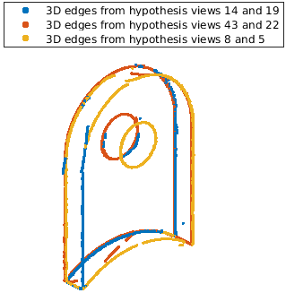

# 3D Edge Sketch from Multiview Images (WACV 2025)
### Research @ LEMS, Brown University

## Introduction:
This is an official repository for the paper _3D Edge Sketch from Multiview Images_ published in WACV 2025. It is a 3D edge reconstruction from multiple calibrated cameras with known poses. Basically, it follows a few steps: _(i)_ detect [third-order edges](https://github.com/C-H-Chien/Third-Order-Edge-Detector) from each image, _(ii)_ pick two hypothesis views (with sufficient overlap in the image while maintaining some levels of baseline) and keep the rest of the views as validation views, _(iii)_ loop over all edges in the first hypothesis view, pair up with the edges falling in the corresponding epipolar wedge, and seek support from the validation views, _(iv)_ triangulate all pairs of edges from the two hypothesis views to reconstruct 3D edges, _(v)_ reproject the 3D edges in order to pick the next two hypothesis views for the second round, _(vi)_ repeat steps _(iii)_ to _(vi)_ until almost all 2D edges claim supports for 3D edges. <br />

## Paper:
```BibTeX
@inproceedings{zheng20253d,
  title={3D Edge Sketch from Multiview Images},
  author={Zheng, Yilin and Chien, Chiang-Heng and Fabbri, Ricardo and Kimia, Benjamin},
  booktitle={2025 IEEE/CVF Winter Conference on Applications of Computer Vision (WACV)},
  pages={3196--3205},
  year={2025},
  organization={IEEE}
}
```

## Dependencies:
(1) CMake 3.14 or higher <br />
(2) Eigen 3.3.2 (higher version is not compatible) <br />
(3) YAML-CPP, can be built from its [official repo](https://github.com/jbeder/yaml-cpp). (This is used only for parsing data from a .yaml file) <br />

## How to build and compile the code
Follow the standard build and compile steps after cloning the repo
```bash
$ mkdir build && cd build
$ cmake ..
$ make -j
```
and you shall see an executive file under ``/buid/bin``. Run the executive file ``./edge_reconstruction-main`` in the ``bin`` folder as there are multiple relative paths used in the code. <br />

## Running an Example
An example using the [ABC-NEF dataset](https://github.com/yunfan1202/NEF_code?tab=readme-ov-file#evergreen_treedataset) where object 00004605 will be demonstrated. The data of object 00004605 is provided in ``datasets/ABC-NEF/00004605/``, including edges and camera matrices. All the settings are defined in ``3D_Edge_Sketch_Settings.yaml`` including the path of the dataset. If you are using multiple CPU cores, make sure to change the corresponding setting in the yaml file (namely, ``Num_Of_OMP_Threads``).
- (1) Run the executable file under ``/buid/bin`` once all settings are done.
- (2) The 3D edges are written in files under ``outputs/`` where the file names include information of the dataset, object, hypothesis view indices, and other settings. Each file is the 3D edges reconstructed by a pair of hypothesis views. <br />
- (3) Visualize the 3D edge sketch using ``visualization/plot_3D_edge_sketch.m``. Below is an example result:
<p align="center">

</p>

## Generating Third-Order Edges and Absolute Poses as Inputs for 3D Edge Sketch
- Third-order edges: use ``preprocesser/third_order_edge_detector/get_RO_Edges_List_in_dataset.m`` which helps generate ``Edge_*_t*.txt``.
- Absolute Poses: use ``preprocesser/get_poses_from_ABC_NEF_dataset.m`` which reads dataset ground-truth file and transform all ground-truth poses to ``R_matrix.txt`` and ``T_matrix.txt``. The example code reads ``transforms_train.json`` file provided by the ABC-NEF dataset.

## Notes
GPU version of the 3D edge sketch has not been publicly released, although it resides in another branch. It needs proper organization and refinement. Will release as soon as it is done.

## Contributors:
Yilin Zheng (yilin_zheng@alumni.brown.edu) <br />
Chiang-Heng Chien* (chiang-heng_chien@brown.edu) <br />
Qiwu Zhang (qiwu_zhang@brown.edu) <br />
*corresponding author <br />
Please file an issue if there is any questions.

## Acknowledgement
Many thanks to [Prof. Ricardo Fabbri](https://rfabbri.github.io/) for contributing to the proposed methodology and assistance on the implementation. 

## References
Third-Order Edge Detector: [paper](https://ieeexplore.ieee.org/abstract/document/8382271) and [code](https://github.com/C-H-Chien/Third-Order-Edge-Detector). The code has been embedded to this repository.


